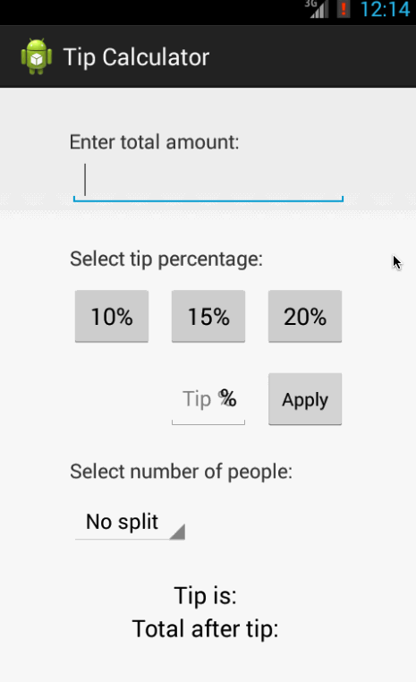

Android training project 1: Tip Calculator
==========================

This is an Android application for a tip calculator. User can calculate the appropriate tip based on the total amount entered.

Time spent: 1 hour spent on basic requirements, 2.5 hour spent on optional ones

Completed user stories:

 * [x] Required: User is displayed the tip of specified percentage for specified entered amount
 * [x] Required: User enters the total amount of the transaction
 * [x] Required: User can select between tip amounts (i.e 10%, 15%, 20%)
 * [x] Required: Upon selecting tip amount, formatted tip value is displayed
 * [x] Optional: User changes the total amount and updated tip is reflected automatically
 * [x] Optional: User can select custom tip percentage if desired
 * [x] Optional: User can select how many ways to split the tip

Walkthrough of all user stories: 

GIF created with [LiceCap](http://www.cockos.com/licecap/).
